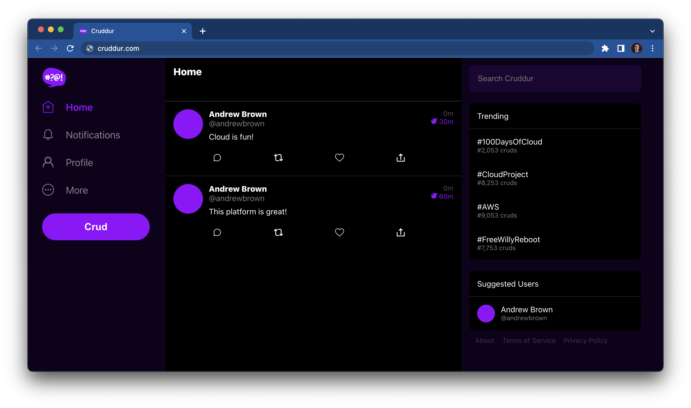

# FREE AWS Cloud Project Bootcamp

- Application: Cruddur
- Cohort: 2023-A1

This is the starting codebase that will be used in the FREE AWS Cloud Project Bootcamp 2023

## Instructions

At the start of the bootcamp you need to create a new Github Repository from this template.

## Journaling Homework

The `/journal` directory contains

- [ ] [Week 0 — Billing and Architecture](https://github.com/imaginarydumpling/aws-bootcamp-cruddur-2023-clone/blob/main/journal/Week%200%20%E2%80%94%20Billing%20and%20Architecture.md)
- [ ] [Week 1 — App Containerization](https://github.com/imaginarydumpling/aws-bootcamp-cruddur-2023-clone/blob/main/journal/Week%201%20%E2%80%94%20App%20Containerization.md)
- [ ] [Week 2 — Distributed Tracing](https://github.com/imaginarydumpling/aws-bootcamp-cruddur-2023-clone/blob/main/journal/Week%202%20%E2%80%94%20Distributed%20Tracing.md)
- [ ] [Week 3 — Decentralized Authentication](https://github.com/imaginarydumpling/aws-bootcamp-cruddur-2023-clone/blob/main/journal/Week%203%20%E2%80%94%20Decentralized%20Authentication.md)
- [ ] [Week 4 — Postgres and RDS](https://github.com/imaginarydumpling/aws-bootcamp-cruddur-2023-clone/blob/main/journal/Week%204%20%E2%80%94%20Postgres%20and%20RDS.md)
- [ ] [Week 5 — DynamoDB and Serverless Caching](https://github.com/imaginarydumpling/aws-bootcamp-cruddur-2023-clone/blob/main/journal/Week%205%20%E2%80%94%20DynamoDB%20and%20Serverless%20Caching.md)
- [ ] [Week 6 — Deploying Containers](https://github.com/imaginarydumpling/aws-bootcamp-cruddur-2023-clone/blob/main/journal/Week%206%20%E2%80%94%20Deploying%20Containers.md)
- [ ] [Week 7 — Solving CORS with a Load Balancer and Custom Domain](https://github.com/imaginarydumpling/aws-bootcamp-cruddur-2023-clone/blob/main/journal/Week%207%20%E2%80%94%20Solving%20CORS%20with%20a%20Load%20Balancer%20and%20Custom%20Domain.md)
- [ ] [Week 8 — Serverless Image Processing](https://github.com/imaginarydumpling/aws-bootcamp-cruddur-2023-clone/blob/main/journal/Week%208%20%E2%80%94%20Serverless%20Image%20Processing.md)
- [ ] [Week 9 - CICD using Codepipeline Codebuild and CodeDeploy](https://github.com/imaginarydumpling/aws-bootcamp-cruddur-2023-clone/blob/main/journal/Week%209%20-%20CICD%20using%20Codepipeline%20Codebuild%20and%20CodeDeploy.md)
- [ ] [Week 10 — CloudFormation Part 1](https://github.com/imaginarydumpling/aws-bootcamp-cruddur-2023-clone/blob/main/journal/Week%2010%20%E2%80%94%20CloudFormation%20Part%201.md)
- [ ] [Week 11 — CloudFormation Part 2](https://github.com/imaginarydumpling/aws-bootcamp-cruddur-2023-clone/blob/main/journal/Week%2011%20%E2%80%94%20CloudFormation%20Part%202.md)
- [ ] [Week 12 — Modern API](shttps://github.com/imaginarydumpling/aws-bootcamp-cruddur-2023-clone/blob/main/journal/Week%2012%20%E2%80%94%20Modern%20APIs.md)
- [ ] [(Week 13 — (Secret Bonus Class).md](https://github.com/imaginarydumpling/aws-bootcamp-cruddur-2023-clone/blob/main/journal/Week%2013%20%E2%80%94%20(Secret%20Bonus%20Class).md)
